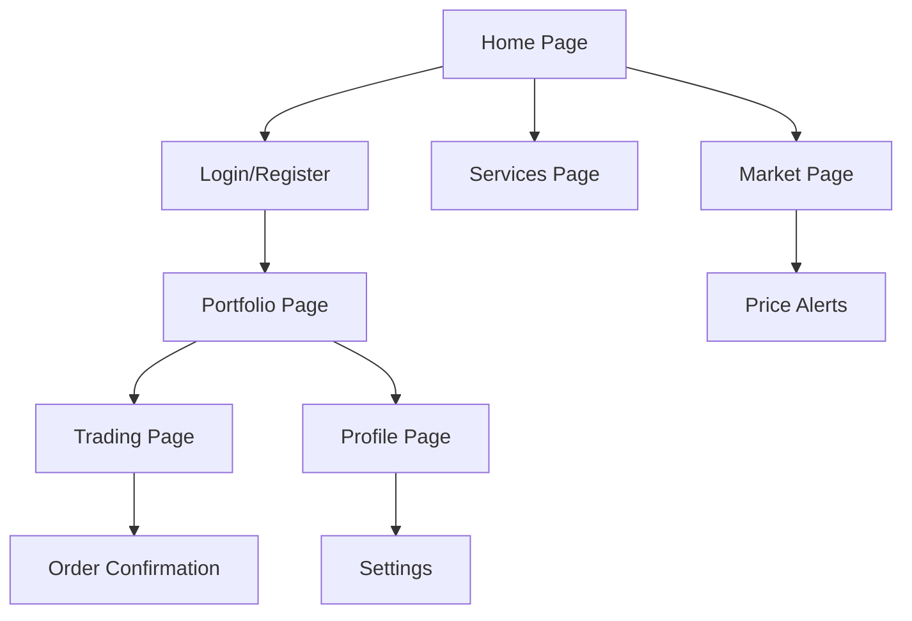

# Kimia Gold PWA React Application - Technical Specification

## 1. Product Overview
Kimia Gold is a Progressive Web Application (PWA) built with React that provides a modern, responsive interface for gold trading and investment services. The application offers real-time gold price tracking, portfolio management, and secure transaction capabilities optimized for both desktop and mobile experiences.

## 2. Core Features

### 2.1 User Roles
| Role | Registration Method | Core Permissions |
|------|---------------------|------------------|
| Guest User | No registration required | View gold prices, browse services |
| Registered User | Email/Phone registration | Portfolio management, transactions, price alerts |
| Premium User | Subscription upgrade | Advanced analytics, priority support |

### 2.2 Feature Module
Our Kimia Gold PWA consists of the following main pages:
1. **Home page**: Hero section with live gold prices, navigation menu, featured services overview
2. **Portfolio page**: Investment dashboard, holdings summary, performance charts
3. **Trading page**: Buy/sell interface, order management, transaction history
4. **Market page**: Real-time price charts, market analysis, news feed
5. **Profile page**: User settings, account management, notification preferences
6. **Services page**: Available services, pricing plans, contact information

### 2.3 Page Details
| Page Name | Module Name | Feature description |
|-----------|-------------|---------------------|
| Home page | Hero Section | Display live gold prices with auto-refresh, trending indicators |
| Home page | Navigation Menu | Responsive navigation with user authentication status |
| Home page | Services Overview | Grid layout showcasing key services with call-to-action buttons |
| Portfolio page | Holdings Dashboard | Real-time portfolio value, asset allocation charts |
| Portfolio page | Performance Analytics | Historical performance graphs, profit/loss calculations |
| Trading page | Buy/Sell Interface | Secure transaction forms with real-time price updates |
| Trading page | Order Management | Active orders display, order history, cancellation options |
| Market page | Price Charts | Interactive candlestick charts with technical indicators |
| Market page | Market News | Curated news feed with filtering and search capabilities |
| Profile page | Account Settings | Personal information management, security settings |
| Profile page | Notification Center | Push notification preferences, alert management |
| Services page | Service Catalog | Detailed service descriptions with pricing information |

## 3. Core Process

**Guest User Flow:**
Guest users can browse the application to view current gold prices and explore available services. They can access market information and educational content without registration.

**Registered User Flow:**
Registered users can manage their investment portfolio, execute trades, set price alerts, and access personalized analytics. They can upgrade to premium services for enhanced features.



## 4. User Interface Design

### 4.1 Design Style
- **Primary Colors**: Gold (#FFD700), Dark Blue (#1B365D), White (#FFFFFF)
- **Secondary Colors**: Light Gray (#F5F5F5), Success Green (#28A745), Error Red (#DC3545)
- **Button Style**: Rounded corners (8px), gradient backgrounds for primary actions
- **Typography**: Inter font family, 16px base size, responsive scaling
- **Layout Style**: Card-based design with clean spacing, top navigation with sidebar
- **Icons**: Feather icons for consistency, gold-themed custom icons for branding

### 4.2 Page Design Overview
| Page Name | Module Name | UI Elements |
|-----------|-------------|-------------|
| Home page | Hero Section | Full-width banner with animated gold price ticker, gradient background |
| Home page | Navigation | Sticky header with logo, menu items, user avatar/login button |
| Portfolio page | Dashboard | Card-based layout with charts, responsive grid system |
| Trading page | Transaction Forms | Clean form design with validation states, progress indicators |
| Market page | Charts | Dark theme charts with golden accents, responsive containers |
| Profile page | Settings Panel | Tabbed interface with form sections, toggle switches |

### 4.3 Responsiveness
The application follows a mobile-first approach with responsive breakpoints at 768px (tablet) and 1024px (desktop). Touch-optimized interactions include larger tap targets, swipe gestures for charts, and pull-to-refresh functionality.

## 5. Technical Architecture

### 5.1 Technology Stack
- **Frontend**: React 18+ with TypeScript
- **State Management**: Redux Toolkit with RTK Query
- **Styling**: Styled-components with responsive design
- **PWA**: Workbox for service workers, Web App Manifest
- **Charts**: Chart.js or Recharts for data visualization
- **Authentication**: JWT with refresh token strategy
- **Build Tool**: Vite for fast development and optimized builds

### 5.2 Project Structure
```
src/
├── components/          # Reusable UI components
├── pages/              # Page-level components
├── hooks/              # Custom React hooks
├── store/              # Redux store configuration
├── services/           # API service layers
├── utils/              # Utility functions
├── types/              # TypeScript type definitions
├── assets/             # Static assets
└── styles/             # Global styles and themes
```

### 5.3 PWA Features
- **Service Worker**: Offline functionality, background sync
- **App Manifest**: Install prompts, splash screens
- **Push Notifications**: Price alerts, transaction confirmations
- **Offline Support**: Cached data display, queue sync when online
- **Performance**: Code splitting, lazy loading, image optimization

### 5.4 Security Considerations
- **Authentication**: Secure token storage, automatic logout
- **Data Validation**: Input sanitization, XSS prevention
- **HTTPS**: Enforced secure connections
- **CSP**: Content Security Policy implementation
- **API Security**: Rate limiting, request validation

## 6. Development Guidelines

### 6.1 Code Standards
- **ESLint**: Airbnb configuration with custom rules
- **Prettier**: Consistent code formatting
- **Husky**: Pre-commit hooks for quality checks
- **TypeScript**: Strict mode enabled, comprehensive typing
- **Testing**: Jest + React Testing Library, 80%+ coverage

### 6.2 Performance Optimization
- **Bundle Splitting**: Route-based code splitting
- **Image Optimization**: WebP format, lazy loading
- **Caching Strategy**: Aggressive caching for static assets
- **Memory Management**: Proper cleanup of subscriptions
- **Network Optimization**: Request deduplication, compression

### 6.3 Accessibility
- **WCAG 2.1 AA**: Compliance with accessibility standards
- **Keyboard Navigation**: Full keyboard accessibility
- **Screen Readers**: Proper ARIA labels and roles
- **Color Contrast**: Minimum 4.5:1 ratio for text
- **Focus Management**: Visible focus indicators

## 7. Deployment Strategy

### 7.1 Environment Setup
- **Development**: Local development with hot reload
- **Staging**: Pre-production testing environment
- **Production**: Optimized build with CDN distribution

### 7.2 CI/CD Pipeline
- **Version Control**: Git with feature branch workflow
- **Automated Testing**: Unit, integration, and E2E tests
- **Build Process**: Automated builds on merge
- **Deployment**: Zero-downtime deployments
- **Monitoring**: Performance and error tracking

## 8. Maintenance and Support

### 8.1 Monitoring
- **Performance Metrics**: Core Web Vitals tracking
- **Error Tracking**: Comprehensive error logging
- **User Analytics**: Usage patterns and behavior
- **Uptime Monitoring**: Service availability tracking

### 8.2 Updates and Maintenance
- **Security Updates**: Regular dependency updates
- **Feature Releases**: Planned feature rollouts
- **Bug Fixes**: Rapid response to critical issues
- **Performance Optimization**: Continuous improvement

This technical specification provides a comprehensive foundation for developing the Kimia Gold PWA React application with enterprise-grade architecture and best practices.